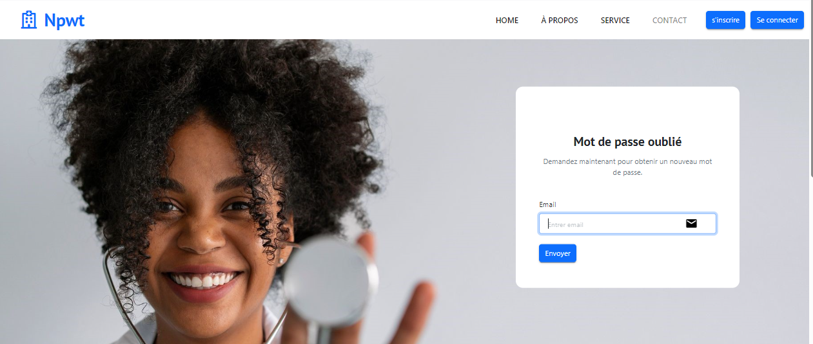
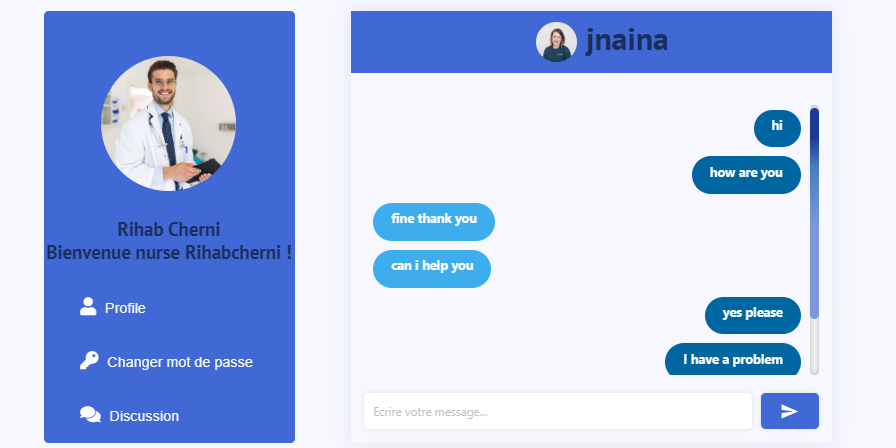

# 💉 NPWT Health Care Application

## Project Description
**NPWT** is a web application developed during an internship at **IPACT Consult Inc.** (Lac 2, Tunis, Tunisia), focused on **managing negative pressure wound therapy treatments**.  
The platform includes:  
- **Detection of treatment types** using an AI model.  
- **Efficient patient care management** through a full-stack interface.  
- **Unit testing, deployment, and CI/CD integration** using Docker and Jenkins.  

This project was executed using **Scrum methodology**, emphasizing teamwork, agile development, and continuous integration.

---

## Tech Stack
- **Frontend:** React.js, HTML5, CSS3, Bootstrap, JavaScript (ES6)  
- **Backend:** Node.js, Express.js, FastAPI  
- **Database:** MongoDB  
- **Tools & Methodology:** GitHub, JIRA, Scrum, Docker, Jenkins, Mocha, Chai  

---

## Main Features
- Interactive dashboard for patient care monitoring
- AI-powered detection of wound care types
- Management of patient records and treatment history
- Secure login system with role-based access
- Responsive interface with Bootstrap
- Unit testing with Mocha & Chai
- Continuous integration and deployment via Jenkins & Docker

---

## Project Screenshots

### User Authentication & Home
<table>
<tr>
    <td align="center">
        
Home Page – Overview 1

        
    </td>
    <td align="center">
        
Home Page – Overview 2

        
    </td>
</tr>
<tr>
    <td align="center">
        
Registration Form

        
    </td>
    <td align="center">
        
Login Form – User

        
    </td>
</tr>
<tr>
    <td align="center">
        
Login Form – Admin

        
    </td>
    <td align="center">
        
Email Verification

        
    </td>
</tr>
<tr>
    <td align="center">
        
Update Password

        
    </td>
    <td align="center">
        
Forgot Password

        
    </td>
</tr>
<tr>
    <td align="center">
        
Reset Password

        
    </td>
    <td align="center">
        
Admin Dashboard – Overview 1

        
    </td>
</tr>
</table>

### Consultations & Patient Management
<table>
<tr>
    <td align="center">
        
Consultation Table

        
    </td>
    <td align="center">
        
Admin Dashboard – Overview 2

        
    </td>
</tr>
<tr>
    <td align="center">
        
Number of Consultations

        
    </td>
    <td align="center">
        
Add Consultation Form 1

        
    </td>
</tr>
<tr>
    <td align="center">
        
Add Consultation Form 2

        
    </td>
    <td align="center">
        
Consultation Details View

        
    </td>
</tr>
<tr>
    <td align="center">
        
Consultation List

        
    </td>
    <td align="center">
        
Consultation Gallery

        
    </td>
</tr>
<tr>
    <td align="center">
        
Consultation Detail

        
    </td>
    <td align="center">
        
Result – Green Status

        
    </td>
</tr>
<tr>
    <td align="center">
        
Result – Red Status

        
    </td>
    <td align="center">
        
Result – Yellow Status

        
    </td>
</tr>
</table>

### Machine & Equipment Management
<table>
<tr>
    <td align="center">
        
Machine Table Overview

        
    </td>
    <td align="center">
        
Add Machine Form

        
    </td>
</tr>
<tr>
    <td align="center">
        
Machine Deletion Confirmation

        
    </td>
    <td align="center">
        
Patient Table – Admin View

        
    </td>
</tr>
<tr>
    <td align="center">
        
Patient List – Doctor View

        
    </td>
    <td align="center">
        
Add New Patient

        
    </td>
</tr>
<tr>
    <td align="center">
        
Update Patient Information

        
    </td>
    <td align="center">
        
Responsible Staff Table

        
    </td>
</tr>
<tr>
    <td align="center">
        
Doctor Consultation Details

        
    </td>
    <td align="center">
        
Add New Doctor

        
    </td>
</tr>
<tr>
    <td align="center" colspan="2">
        
Chatbot Interface

        
    </td>
</tr>
</table>
